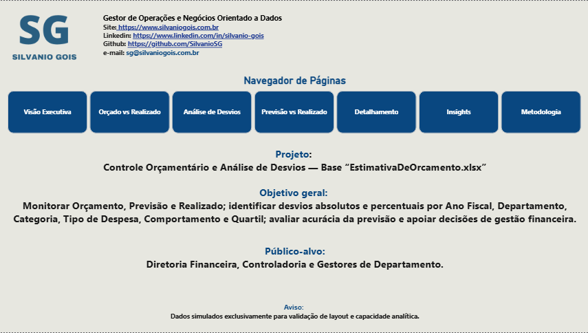
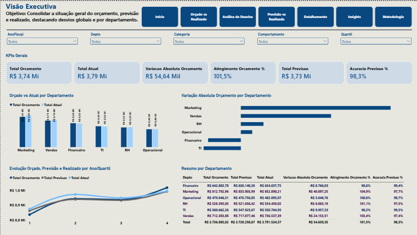
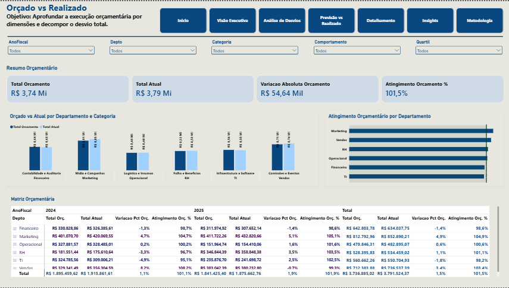
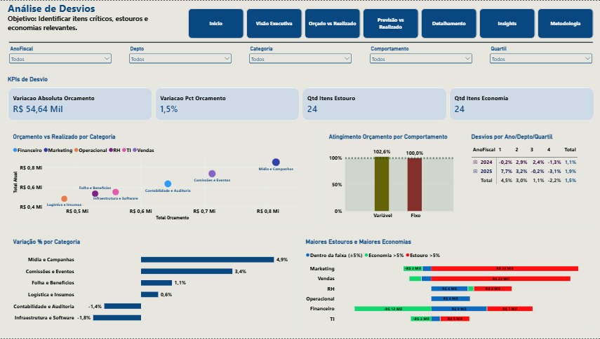
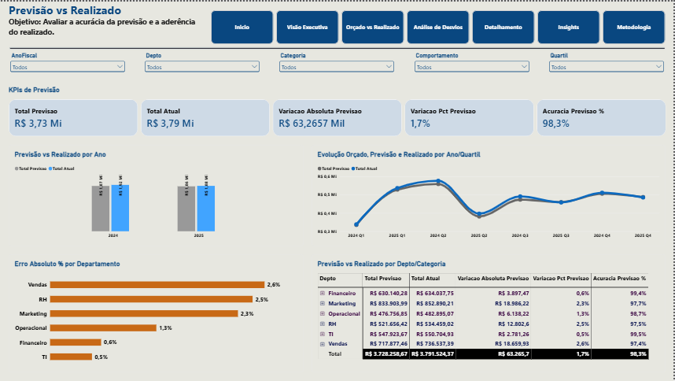
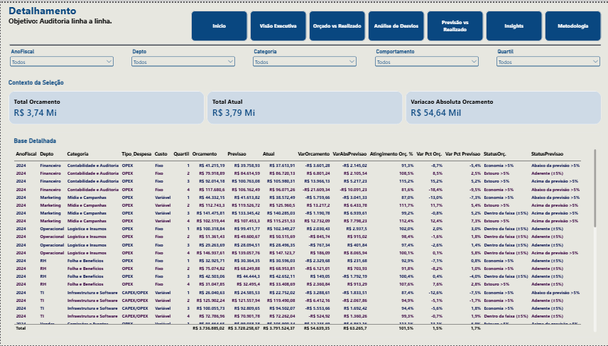
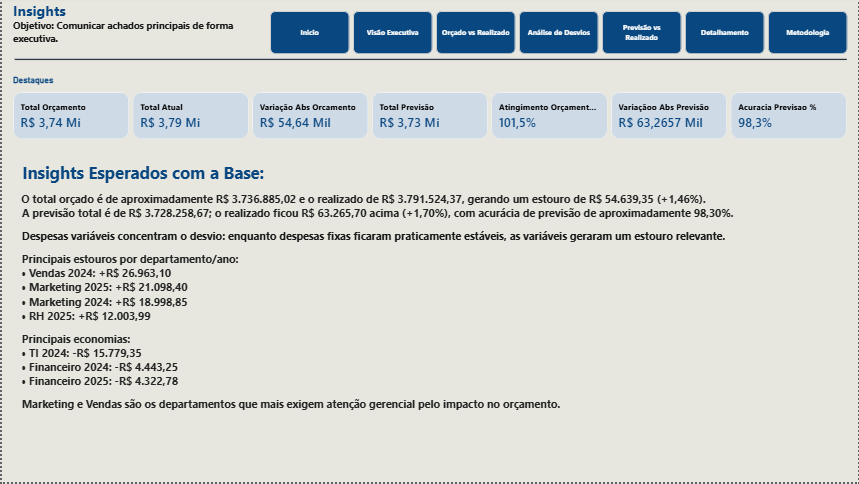
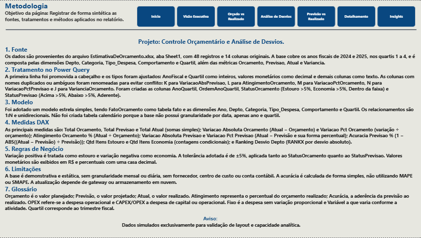

# Controle Orçamentário e Análise de Desvios

Relatório analítico desenvolvido em Power BI para monitoramento de orçamento, previsão e realizado, com foco na identificação de desvios absolutos e percentuais, avaliação da acurácia da previsão e apoio à decisão em gestão financeira.

**Autor:** Silvanio Gois — Gestor de Operações e Negócios Orientado a Dados  
**Site:** https://www.silvaniogois.com.br  
**LinkedIn:** https://www.linkedin.com/in/silvanio-gois/  
**GitHub:** https://github.com/SilvanioSG  
**Relatório online:** https://app.powerbi.com/view?r=eyJrIjoiNjFkOWEyMTItNWUxYy00YTJkLThkM2YtNTcyZTQ1ZjY5MGUyIiwidCI6IjJlYmQyYzU0LWY1ZDMtNGVmYi05ZGE3LWU4Yzk0YmQyMWQzOSJ9

---

## 1. Objetivo

O projeto tem como objetivo entregar um relatório executivo e analítico que permita à Controladoria e à Diretoria Financeira acompanhar a execução orçamentária por Ano Fiscal, Departamento, Categoria, Tipo de Despesa, Comportamento e Quartil, identificar estouros e economias, medir a aderência ao orçamento e avaliar a qualidade da previsão em relação ao realizado. A base é demonstrativa e foi construída para evidenciar competências em modelagem de dados, DAX e gestão financeira aplicada em Power BI.

---

## 2. Arquivos do Projeto

**Fonte de dados**
- `EstimativaDeOrcamento.xlsx`

**Arquivos gerados**
- `ControleOrcamentario&AnaliseDeDesvios.pbix`
- `ControleOrcamentario&AnaliseDeDesvios.pdf`
- `pagina1.png` a `pagina8.png` (capturas do relatório)

---

## 3. Fonte e Escopo dos Dados

A base contém 48 registros e 14 colunas originais, referentes aos anos fiscais de 2024 e 2025, nos quartis 1 a 4. As dimensões consideradas são Depto (Financeiro, RH, TI, Vendas, Marketing e Operacional), Categoria, Tipo_Despesa (OPEX e CAPEX/OPEX) e Comportamento (Fixo e Variável). As métricas originais são Orcamento, Previsao, Atual e Variancia.

---

## 4. Metodologia Técnica

**Tratamento no Power Query**  
A primeira linha foi promovida a cabeçalho e os tipos foram ajustados (AnoFiscal e Quartil como inteiros, valores monetários como decimal, demais colunas como texto). Colunas com nomes duplicados ou ambíguos foram renomeadas para evitar conflito: K → `VariacaoAbsPrevisao`, L → `AtingimentoOrcamento`, M → `VariacaoPctOrcamento`, N → `VariacaoPctPrevisao` e J → `VarianciaOrcamento`. Foram criadas as colunas `AnoQuartil`, `OrdemAnoQuartil`, `StatusOrcamento` e `StatusPrevisao`.

**Modelo de Dados**  
Foi adotado um modelo estrela simples, com `FatoOrcamento` como tabela fato e as dimensões `DimAno`, `DimDepartamento`, `DimCategoria`, `DimTipoDespesa`, `DimComportamento` e `DimQuartil`. Relacionamentos 1:N unidirecionais. Não foi criada tabela calendário, pois a base não possui granularidade por data.

**Medidas DAX**  
As principais medidas incluem Total Orcamento, Total Previsao, Total Atual, Variacao Absoluta Orcamento, Variacao Pct Orcamento, Atingimento Orcamento %, Variacao Absoluta Previsao, Variacao Pct Previsao, Acuracia Previsao %, Qtd Itens Estouro, Qtd Itens Economia e Ranking Desvio Depto.

**Regras de Negócio**  
Variação positiva é tratada como estouro e variação negativa como economia. A tolerância adotada é de ±5%, aplicada tanto ao StatusOrcamento quanto ao StatusPrevisao. Valores monetários são exibidos em R$ e percentuais com uma casa decimal.

---

## 5. Estrutura do Relatório

O relatório é composto por oito páginas, organizadas em sequência lógica: abertura, análise executiva, comparações orçamentárias, análise de desvios, avaliação da previsão, detalhamento, insights e metodologia.

### Página 1 — Início
  
Capa do relatório com identificação do projeto, autor e navegação para as demais páginas.

### Página 2 — Visão Executiva
  
Consolidação dos KPIs gerais, comparação Orçado x Realizado por ano e evolução trimestral das três métricas.

### Página 3 — Orçado vs Realizado
  
Análise comparativa por departamento e categoria, com atingimento orçamentário, cascata de contribuição para o desvio total e matriz cruzada.

### Página 4 — Análise de Desvios
  
Identificação de itens críticos, estouros e economias por categoria, comportamento e quartil, com destaque para os maiores desvios.

### Página 5 — Previsão vs Realizado
  
Avaliação da acurácia da previsão por ano, quartil, departamento e categoria, com erro absoluto percentual.

### Página 6 — Detalhamento
  
Tabela granular com todas as dimensões e métricas calculadas, incluindo status de orçamento e previsão. Drill-through habilitado por departamento e categoria.

### Página 7 — Insights
  
Síntese executiva dos principais achados, com narrativa dinâmica e indicadores-chave.

### Página 8 — Metodologia
  
Documentação sintética de fonte, tratamento, modelo, medidas, regras de negócio, limitações e glossário.

---

## 6. Insights Analíticos

O total orçado é de aproximadamente R$ 3.736.885,02 e o realizado de R$ 3.791.524,37, gerando estouro de R$ 54.639,35 (+1,46%). A previsão total é de R$ 3.728.258,67; o realizado ficou R$ 63.265,70 acima (+1,70%), com acurácia de previsão de aproximadamente 98,30%.

As despesas variáveis concentram o desvio relevante, enquanto as despesas fixas permaneceram praticamente estáveis. Os principais estouros ocorreram em Vendas 2024 (+R$ 26.963,10), Marketing 2025 (+R$ 21.098,40), Marketing 2024 (+R$ 18.998,85) e RH 2025 (+R$ 12.003,99). As principais economias foram em TI 2024 (−R$ 15.779,35), Financeiro 2024 (−R$ 4.443,25) e Financeiro 2025 (−R$ 4.322,78). Marketing e Vendas são os departamentos que mais exigem atenção gerencial pelo impacto no orçamento.

---

## 7. Limitações

A base é demonstrativa e estática, sem granularidade mensal ou diária, sem fornecedor, centro de custo ou conta contábil. A acurácia é calculada de forma simples, não utilizando MAPE ou SMAPE. A atualização depende de gateway ou armazenamento em nuvem.

---

## 8. Tecnologias Utilizadas

- Power BI Desktop (modelagem, DAX e visualização)
- Power Query (tratamento e transformação)
- Excel (fonte de dados)
- GitHub (versionamento e publicação)

---

## 9. Contato

**Silvanio Gois**  
Gestor de Operações e Negócios Orientado a Dados  
https://www.silvaniogois.com.br  
https://www.linkedin.com/in/silvanio-gois/  
https://github.com/SilvanioSG